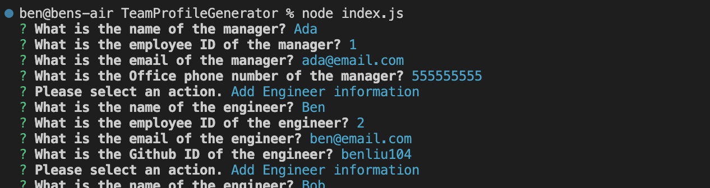
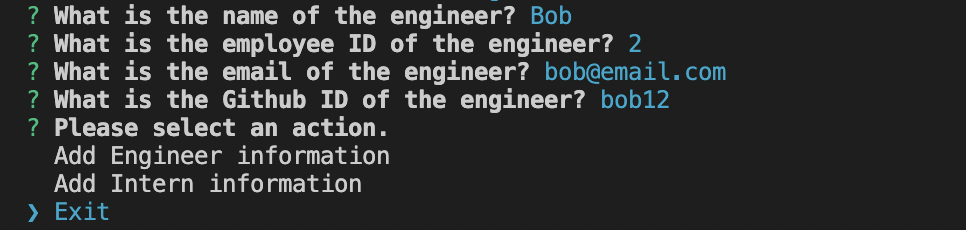

# TeamProfileGenerator

## Description
This project is creating a generator that generate team structure diagram as a HTML file.

## Table of Contents
- [Installation](#installation)
- [Usage](#usage)
- [Credits](#credits)
- [License](#license)
- [Tests](#tests)
- [Questions](#questions)

## Installation
Run command "npm install"

## Usage
1.Run command "node index.js" to start the application.

2.Answer the question by following the instruction.

3.When "Exit", HTML file with name will be generated in /dist folder.

Please refer to the video for demo:

https://www.youtube.com/watch?v=Ebf3PT1lxhA

## Credits

BenLiu104 : https://github.com/BenLiu104

## License

License - MIT

## Tests
Jest test script was used to perform the unit test of the code.

